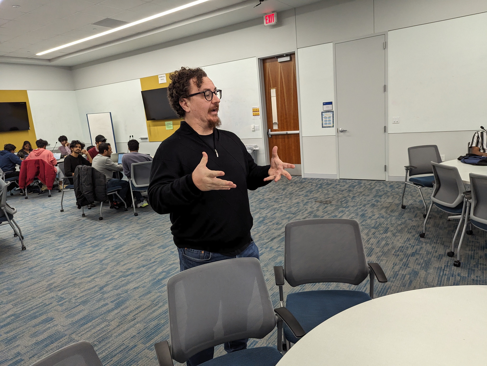
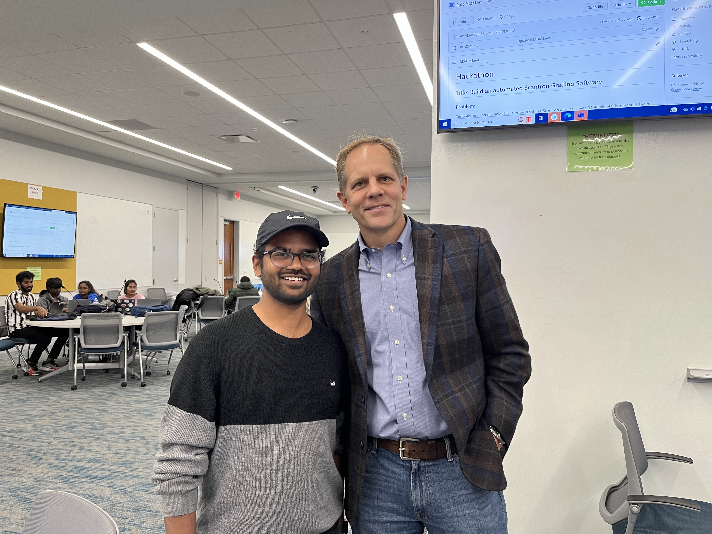
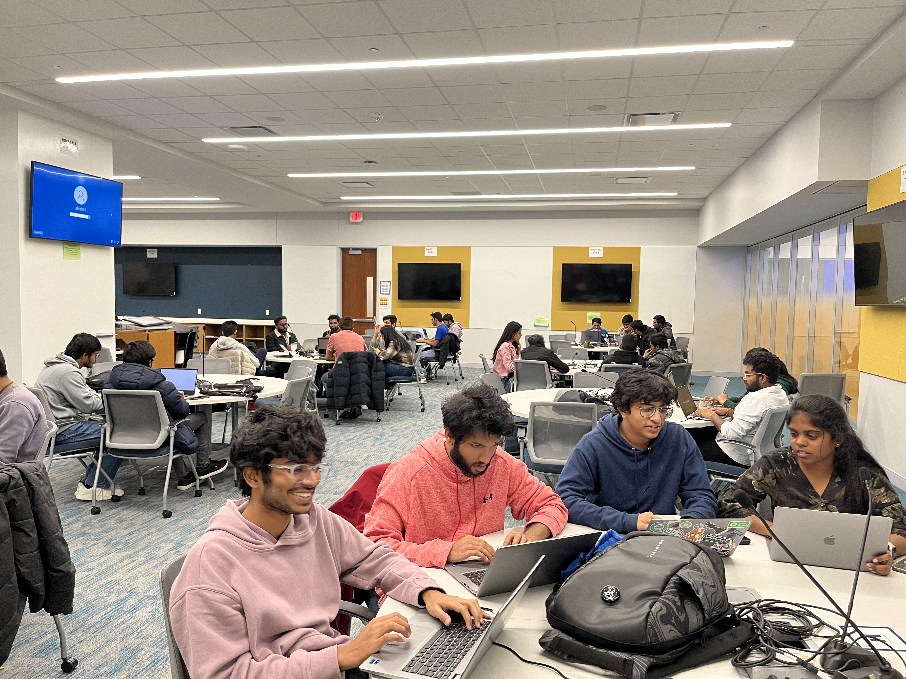

18 teams comprising 58 students put all their programming skills to work for a two-hour hackathon that took place on 27th November at Saint Louis University.

<!--truncate-->

**What:**  
**Who:** [Abhilash Kotha](https://www.linkedin.com/in/abhilashkotha/), student in MS Computer Science and graduate research assistant organized the hackathon in collboration with global grad initiative at SLU 
**When:** Thursday, September 21 to Friday, September 22 (2 days) 
**Where:** [Saint Louis University](https://www.slu.edu/admission/visit/index.php)
**Resources:** [Problem Statement](https://github.com/slu-hackathon-2023/Get-Started), [SLU - Newslink](https://www.slu.edu/news/announcements/2023/december/global-graducate-scholars-hackaton.php)

On Monday the 27th of November, a Hackathon was conducted as part of a project under the Global Grad Initiative. With the support of Dr. Eric Armbrecht, the founding director of the Global Grad initiative, Hackathon was organized by Abhilash Kotha and a dedicated team of 7 other MS students.

As part of the challenge, all the 18 teams tried to solve a real-time issue of grading scantron answer sheets. Orchestrated with the help of Dr. Kate Holdener and Mr. Daniel Shown, the challenge kept the participants busy for the entire duration. The prize money of $500 will be awarded to the winning team in the coming week once submissions have been reviewed.

Throughout the day, students collaborated and put their skills to practice, benefiting from the opportunity to solve practical problems and gain hands-on experience. Dr. Holdener and Mr. Shown visited the venue to support the student teams. They interacted with teams and clarified any doubts the students had about the requirements.

The hackathon concluded with Dr. Armbrecht distributing certificates of participation to the teams and applauding their efforts and engagement. Feedback from participants highlighted appreciation for the practical experience and the motivation they gained from working under such conditions. Describing his experience with the event, one of the participants Ramakanth said,

“This Hackathon was my first technical competition ever. Throughout the intense 2 hours, I learned so much from my teammates about collaborating under pressure to tackle a complex real-world problem. I am looking forward to more such events”

Any promising solutions produced as part of the students can potentially be used by Open Source with SLU in building an open source software product that automatically grades scantron answer sheets. 

