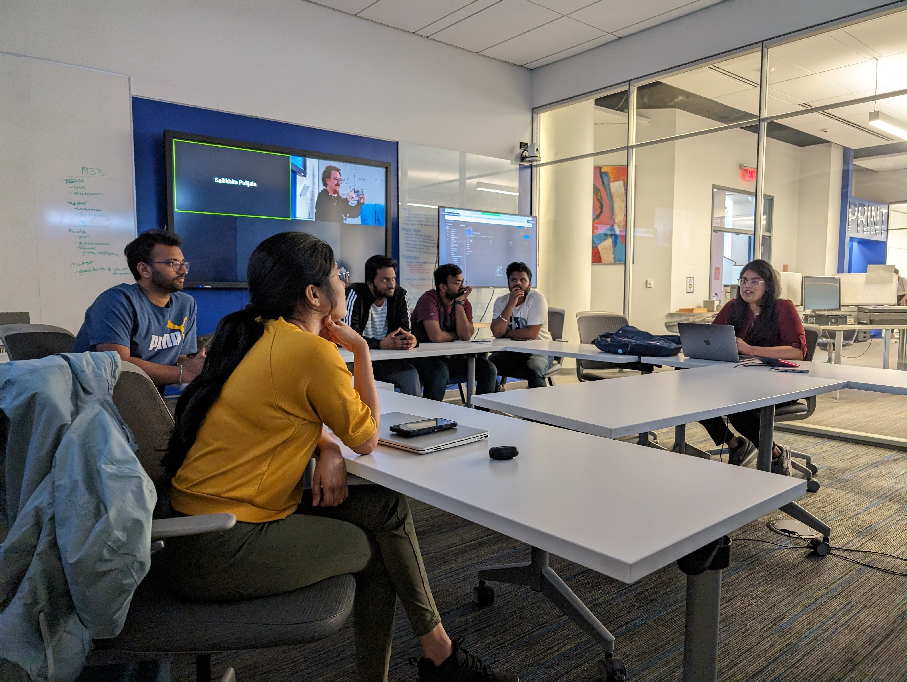
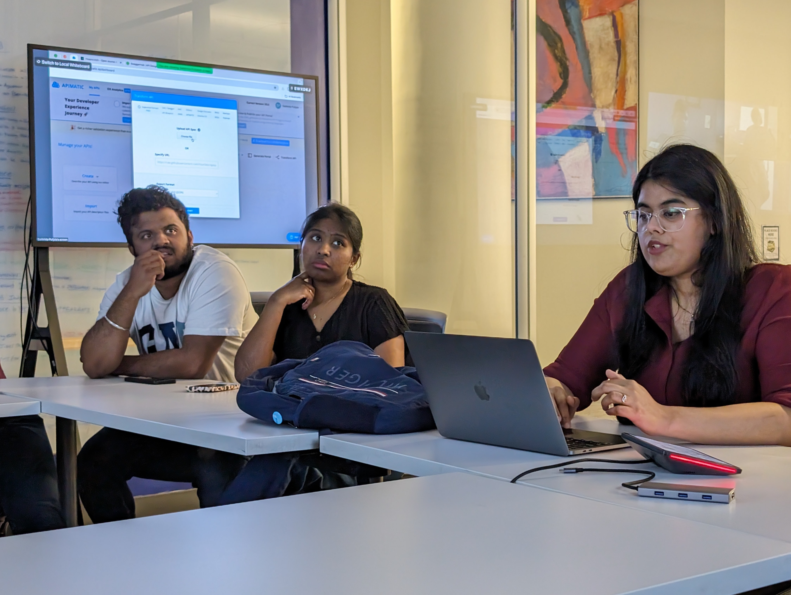

I organized and led a successful workshop on API testing tools at the ATC Pius library, where 10 enthusiastic students attended the session and actively engaged in the live demonstration.

<!--truncate-->

**What:** The Pioneers of API Testing - Embracing Open Source Tools 
**Who:** Presentedy by [me](https://github.com/LikhitaPulijala), MS student in Computer Science and Graduate Research assistant at OSS SLU 
**When:** Friday, February 23 
  3:00-4:00 p.m. (1 hour) 
**Where:** [Pius Library, ATC](https://www.slu.edu/library/services/academic-technology-commons/index.php)

In this workshop, I showcased several essential tools in the realm of API testing and emphasizes the collaborative nature of FOSS in driving innovation in software development. Below is the brief summary of the contents explained in the workshop.

In the ever-evolving landscape of software development, the pivotal role of Application Programming Interfaces (APIs) is undisputed. APIs serve as the backbone of digital interactions, enabling seamless communication between diverse software components. Amidst this scenario, the significance of API testing tools, particularly those anchored in the Free and Open-Source Software (FOSS) philosophy, cannot be overstated.

## The Foundation of FOSS in API Development

FOSS stands as a testament to the collaborative spirit of the software development community. It offers tools that are not only free to use but also grant users the liberty to inspect, modify, and enhance the source code. This open environment fosters innovation and accelerates the advancement of API testing methodologies, ensuring that developers have access to tools that are both powerful and adaptable to their ever-changing needs.

## Exploring Essential API Testing Tools

The realm of API testing is rich with tools designed to streamline the testing process, enhance collaboration, and ensure the delivery of robust APIs. Among these tools, certain names stand out for their contributions to the FOSS community:

### Postman: The Swiss Army Knife of API Testing

Postman isn't just a simple utility, it's a complete environment tailored for API development. Its widespread appeal is rooted in its user-friendly interface, catering to both novices and experienced developers. Postman empowers users to swiftly craft intricate HTTP requests, inspect responses, and automate API testing. Through features like collection management, folder organization, and seamless sharing among team members, Postman cultivates a collaborative development atmosphere. Its intuitive design streamlines API creation, sharing, and testing processes, supporting various request methods and providing tools like collections and environments for efficient API management. By facilitating team collaboration, Postman facilitates smoother cooperation among developers working on API projects.

### Hoppscotch: A Leap Towards Simplicity and Collaboration

Once called Postwoman, Hoppscotch emerges as an open-source tool for crafting API requests right from a web browser, sparing users the hassle of desktop setups. Its allure lies in its straightforwardness and broad protocol support, including WebSocket, GraphQL, and SSE, catering to diverse testing needs. Hoppscotch excels as a web app, fostering real-time collaboration and boasting cloud syncing capabilities. Its versatility extends across various environments, making it a prime option for API testing.

### Insomnia: Streamlining API Workflows

Insomnia is well-known for its simplistic method in API testing, offering a neat and easy-to-use interface. It's especially beneficial for developers dealing with REST, GraphQL, and gRPC APIs. Its lightweight structure makes it a popular choice for individuals who value quickness and effectiveness without compromising on features. Recognized for its straightforwardness and minimal design, Insomnia is tailored for developers seeking an effective tool supporting request sequencing and prioritizing performance. Its open-source basis fosters community involvement, consistently enhancing its range of features.

### Swagger: Standardizing API Development

Swagger, alternatively referred to as the OpenAPI Specification, offers a consistent, language-independent method for interfacing with REST APIs. This enables both people and machines to grasp the functionalities of a service without requiring access to source code, explicit documentation, or examination of network traffic. Tools associated with Swagger, such as Swagger UI and Swagger Editor, simplify the process of designing, documenting, and utilizing APIs. Swagger adopts a holistic approach to API testing, with a focus on security, code generation, and establishing norms. It assists in streamlining API governance, guaranteeing adherence to industry best practices and standards.

Each of these tools brings unique advantages to the table, contributing to more efficient, collaborative, and high-quality API development and testing processes. By leveraging these open-source resources, development teams can not only accelerate their workflows but also ensure that their APIs are robust, reliable, and ready for integration into complex software ecosystems.

## Empowering Innovation Through Collaboration

The essence of FOSS in API testing is not just about offering free tools but about cultivating an environment where innovation thrives through collaboration. These tools, developed and refined by the community, ensure that developers have access to resources that are not only advanced but also adaptable to the unique challenges of API testing.

In conclusion, as we navigate the intricate web of digital interactions facilitated by APIs, the role of FOSS tools in testing and development becomes increasingly paramount. They not only equip developers with the necessary resources but also embody the spirit of open collaboration that drives the software industry forward.
