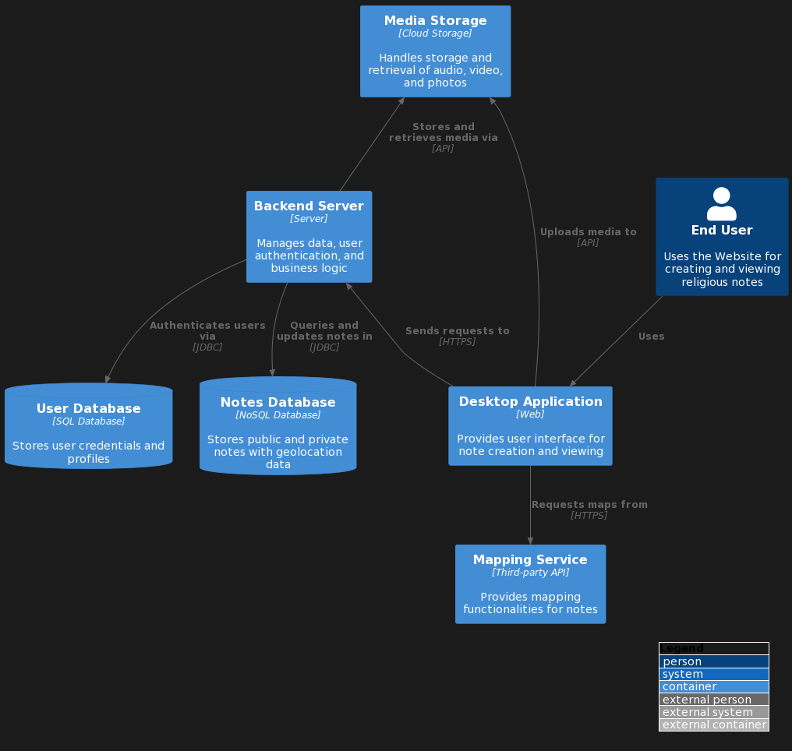

## Overview

 Where's Religion? is conceptualized and designed for diverse users with interests in sharing media and notes about their respective encounters with "religion" in everyday places. Nearly all digital humanities scholarship in religion, theology, and adjacent fields perpetuates historical biases of text-based knowledge and media. While texts are no doubt essential to these fields, the premise of Where’s Religion? has been to create tools for acknowledging, analyzing, and interpreting religion as a multisensory and multimodal component of human life, both within faith traditions and beyond them in the fabrics of culture and society. We believe that it is time for our research methodologies to catch up with the realities of human experience and that creating a platform for collecting, organizing, and sharing images, videos, and sounds, along with textual notations, sourced from a wide range of users, is a necessary place to start. We also believe that the resulting collection of materials will be of immense value to American public life.

### Information

- **Source Code:** <https://github.com/oss-slu/lrda_website>
- **Client** Dr.Adam Park
- **Current Tech Lead:** [Yash Bhatia](https://yashb196.github.io/yashb196/, https://github.com/yashb196, https://www.linkedin.com/in/yashbhatia238/.)
- **Developers:**
  - [Stuart Ray](https://github.com/Stuartwastaken)(capstone)
  - [Izak Robles](https://github.com/izakrobles)(capstone)
  - [Josh Hogan](https://github.com/Josh-Hogan-87)(capstone)

  - [Varsith Reddy Legala](https://github.com/VarsithReddyLegala) (volunteer)
- **Start Date:** 25 Aug 2023
- **Adoption Date:** 25 Aug 2023
- **Technologies Used:** 
  - Tech Stack: The core technologies include React development and TypeScript for adding static type definitions to JavaScript​​.
  - Key Languages: TypeScript is used along with JavaScript​​​​.
  - Key Frameworks: Next JS is the primary framework for building the app's user interface, and Tailwind CSS for the designing​​.
  - Databases: While the specific database technologies are not mentioned in the quoted sections, the app connects to the Rerum Website for data integration, which may imply the use of web APIs to interact with backend data storage​​.
  - Critical Dependencies: Node.js is a runtime requirement for executing the JavaScript code, and the dependency management is handled by pnpm, as indicated by the use of pnpm install and pnpm start commands for setting up the app​​​​​​.
- **Type:** Desktop
- **License:** [MIT](https://opensource.org/license/mit/)

## User Guide

- End user will log into the application 
- When logged in there will be an option to either view global notes(notes that other people published) or view an empty page with a button on the left "Add Note" which will enable the user to create a note.
- once clicked on the button the user can then add a title (manditory) along with audio/video/photo/ tags(manditory) and text for the note 
- click on the top right icon to make it public
- if you still need it private go back.
- map will represent all the global notes and where it is generated (similar to the mobile application).
- user can search an entry based on the tags mentioned in the post.
, and link to the Where's Religion Documentation[detailed user-oriented documentation](https://github.com/oss-slu/lrda_website/blob/main/README.md).

## Overview
Overview of the software architecture.

Where’s Religion is an open-source mobile and desktop application that supports in-person research, remote data entry, media sharing, and mapping. To do this, the mobile app enables users to collect fieldnotes, images, videos, and audio files - all geotagged and timestamped. The desktop companion app provides a more feature-rich format to refine fieldnotes, make new entries, or, for certain user profiles, review or grade other users’ entries. When published, all entries are automatically curated on a publicly available, interactive map with search and filter functions for research. We have conceptualized and designed for students, researchers, and public users to document and share their respective encounters with “religion” in everyday life – all with the intended purpose of democratizing data collection and visualizing religious diversity at scale.

## Development Priorities

- There is **user interface** changes are required which should follow (ShadCN)[https://github.com/shadcn-ui/ui]
- The Pages to add note/edit note should have the functionality to access photos and videos from local systems.
- The Map Page should be built based on either open street maps or leaflet.
- The notes should be fetched onto the home page.

## Get Involved

Overview of contribution and participation information, [contributors guide](https://github.com/oss-slu/lrda_website/blob/main/README.md)
