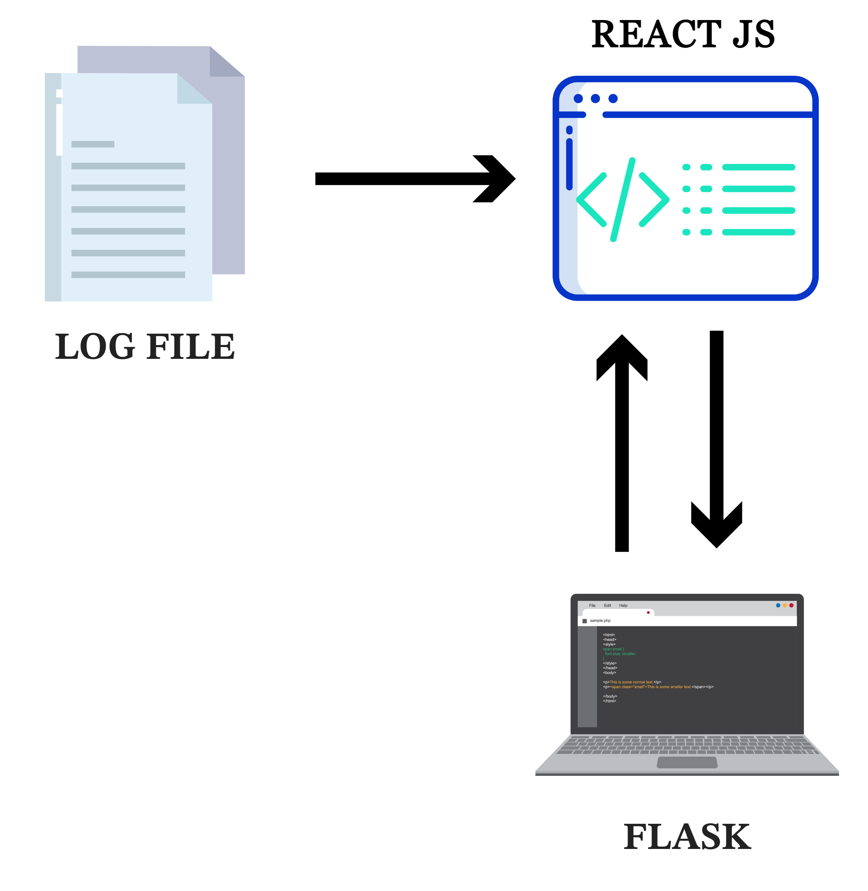

<!-- A header image is optional; if used should be no greater than 200x600 -->
<!-- -->

## Overview

The SLU computational chemistry researchers, working on understanding various properties of molecules, use various software tools. Some of such tools are ORCA, Jaguar, and Gaussian software. These tools process input data and produce results in the form of a log file (text format). These log files contain information about the calculations, the progress of the calculations, and the results of the calculations. To make use of the calculation results, researchers manually process numerous log files, copy and paste the data to spreadsheets and Word documents, and then proceed with their work. The objective of this project is to remove the manual labor associated with processing these log files through software automation.

### Information

- **Source Code:** [https://github.com/oss-slu/esp](https://github.com/oss-slu/esp) 

- **Client** Dr. Ryan McCulla
- **Current Tech Lead:** Raju Karmuri  
- **Developers:**

  - Hayden Karl 

  - Medhani Kalal 

- **Start Date:** Jan, 2024
- **Adoption Date:** Aug, 2022
- **Technologies Used:**
  - Angular
  - Flask
- **Type:** Web application
- **License:** [MIT](https://opensource.org/license/mit)

### User Guide

The proof of concept version of this software had been previously developed by a capstone team last year. This proof-of-concept software was originally referred to as Orca Converter (or Orca Data Converter). We would like for the tool to eventually be applied to process log files from other computational chemistry software
tools, such as Gaussian and Jaguar. The frontend component should allow the user to upload the text log files, choose the type of the input files (i.e., Gaussian/ORCA), and pick the number of rows from the text file. The backend component receives the input from the user and processes the data and sends the results in a tabular form. The tabular form is saved to a Word document and allows user to download from the frontend component.

## Technical Information

### Technical Overview

Overview of the software architecture.

### Development Priorities

- Develop a robust frontend component that allows user to upload the ORCA/Gaussian data
- Develop the backend component to receive the text files from the frontend component
- The backend component should work efficiently to extract the information required by client
- The backend component should receive the results in a tabular form and save in a Word document
- The backend component should send the Word document to frontend
- The frontend component allows user to download the Word document

## Get Involved

If you would like to contribute to this project, please visit our [GitHub page](https://github.com/oss-slu/esp) to create your own issues or pull requests.
