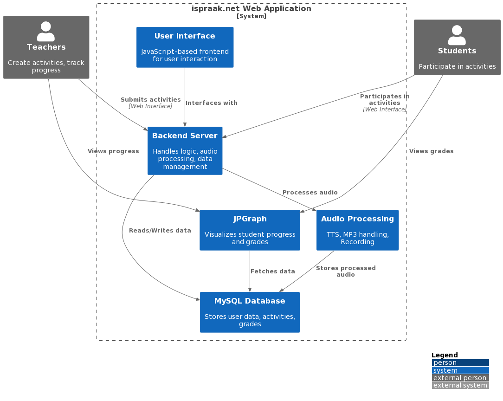

<!-- A header image is optional; if used should be no greater than 200x600 -->
<!-- -->

## Overview

### Information

- **Web URL:** [Ispraak](https://ispraak.net)
- **Source Code:** [GitHub](https://github.com/dnickol1/ispraak_open/) 
- **Client** [Dr. Dan Nickolai (Director of the Language Resource Center)](https://www.slu.edu/arts-and-sciences/languages-literatures-cultures/faculty/nickolai-dan.php)
- **Current SDE:** [Chintak Joshi](https://chintakjoshi.github.io/chintakjoshi)  
- **Start Date:** September, 2014
- **Adoption Date:** September, 2023
- **Technologies Used:** 
  - PHP
  - JavaScript
  - MySQL
- **Type:** Web Application
- **License:** [MIT](https://opensource.org/license/mit)

## Users

The primary users of Ispraak are educators and students, each with distinct roles and interactions within the platform.

#### Educators:
* Create and manage language learning activities.
* Choose the method of delivery for these activities (using TTS, uploading an MP3 file, or recording a new prompt).
* Generate and access unique URLs: one for monitoring student progress and scores, and another for students to participate in the activities.
* Review comprehensive reports on student performance and progress using JPGraph.

#### Students:
* Access and participate in language learning activities through the provided URL.
* Engage with various types of content delivery (TTS, pre-recorded audio by the educator, or custom recordings).
* Receive instant feedback on their performance to aid in language learning.
* Track their own progress over time, including improvements in language proficiency.

## Technical Information

Overview of the software architecture.

 
## Software Architecture Overview

Ispraak is a tool designed for educational purposes, focusing on automated speech evaluation to assist language learners with immediate feedback. Its primary users are students and educators. Educators have the ability to create reading activities for their students, with three distinct options for delivering the text: 1) Utilizing a synthetic text-to-speech (TTS) voice, 2) Uploading a custom MP3 audio file, or 3) Recording a new audio prompt directly within the application.

When an educator finalizes and submits an activity, Ispraak generates two unique URLs. The first URL is for the educator, allowing them to view all participating students' scores and progress. The second URL is distributed to students, providing them access to undertake the specified activity.

Moreover, Ispraak enables educators to monitor and assess each student's progress and academic performance. This is facilitated through the integration of the JPGraph library, which offers graphical representations of student progress and grade analytics.

The application's architecture comprises a frontend developed in JavaScript, a backend powered by PHP, and a MySQL database for data management and storage. This structure ensures a seamless and interactive user experience while maintaining robust data handling and processing capabilities.

## Development Priorities

- Integrating Ispraak with Learning Management Systems (LMS) using the LTI 1.3 Protocol.
- Enhancing the frontend design of Ispraak for improved user-friendliness and aesthetic appeal.

## Get Involved

<!-- A group photo is optional; if used should be no greater than 800x800 -->
<!-- -->
Developers joining the project should follow the instructions in the 
[README](https://github.com/dnickol1/ispraak_open/#readme) 
file of the project repository to run the application in a development environment.