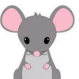
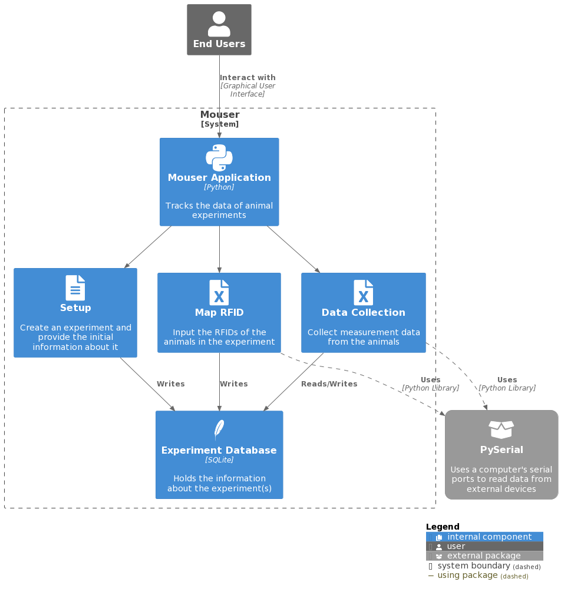

 

## Overview

Created mainly for SLU researchers, this software is used for collecting and analyzing data from animal experiments. While in the lab, scientists are often required to keep their environments very clean, which means that they must limit how much they touch the computers and lab equipment. To facilitate this, Mouser allows laboratory equipment (balances, calipers, RFID chip readers) to be connected to a PC, and researchers can quickly take repeated measurements with as little interaction as possible. Running as a desktop app, users of the software can create and manage experiments in one easy place. Animals implanted with RFID biochips can be scanned into the system for easy identification and data access. Once a session is started, the user is able to take measurements of the animals using devices connected to the computer without having to use the keyboard or the mouse. The program gives confirmation to the user through sounds and changes in display, allowing them to focus on the experiment.

### Information

- **Source Code:** [https://github.com/oss-slu/Mouser](https://github.com/oss-slu/Mouser) 
- **Client:** Dr. Karoly Toth
- **Current Tech Lead:** Logan Wyas 
- **Developers:**

  - Ryan Carmody (capstone)  
  - Andrew Obermiller (capstone) 
  - Stanley Yang (capstone) 
  - Uday Prasad Aitha (alumni, previous tech lead) 
  - Tyler Bush (alumni)  
  - Cori Diaz (alumni)  

- **Start Date:** July 2022
- **Adoption Date:** July 2022
- **Technologies Used:**
  - Python
    - Tkinter
    - PySerial
  - SQLite
- **Type:** Desktop
- **License:** [GNU General Public License v3.0](https://opensource.org/license/gpl-3-0/)

### User Guide

Upon running the software, you will first login using the account information you have been given. Then, to get to the main part of the application, click on the "Experiments" button. This will bring you to a page with have a list of experiments and the option to create a new experiment. If chosing to create a new experiment, you will enter in all of the experiment information that is necessary for the application. If you click on one of the experiments, it will bring you to the menu of that experiment. From there, you have the option to map animals with RFID, collect measurement data, and configure animal groups.

## Technical Information

### Technical Overview

Overview of the software architecture.

### Development Priorities

- Connect the application to hardware devices
- Create a modern-looking user interface
- Add automated testing
- Implement account management
- Build an executable for the software
- Make warning/error screens to prevent internal issues

## Get Involved

If you would like to contribute to this project, please visit our [GitHub page](https://github.com/oss-slu/Mouser) to create your own issues or pull requests.
