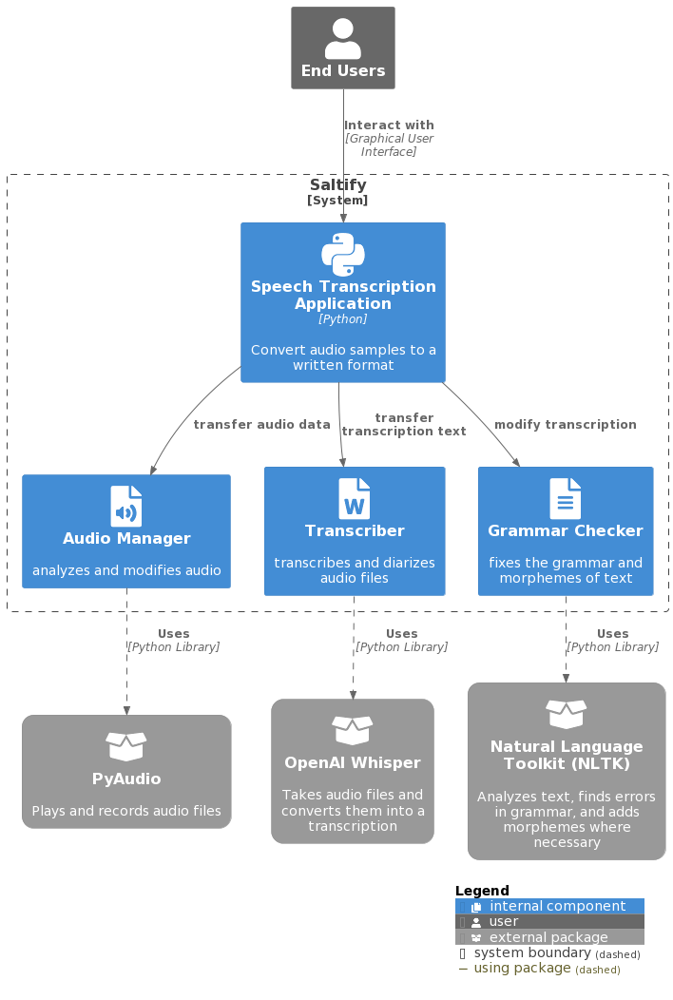

## Overview

 Children naturally produce speech sound errors, language errors, and language features, such as disfluencies. Language errors and features are diagnostically meaningful to speech-language pathologists (SLPs) and need to be maintained in the transcription. The primary purpose of the application is to transcribe an audio sample into a written format that is accepted by SALT software. SALT software is commercially-licensed software that analyzes the speech of children and scores it according to their metrics. Our application can currently transcribe audio samples of a conversation between a child and an adult into text. It also allows users to add grammar checking to the transcription, which looks for possible errors in grammar within the text.

_Note: careful review by a knowledgeable speech-language pathologist is required for an accurate final product._

### Information

- **Source Code:** [https://github.com/oss-slu/SpeechTranscription](https://github.com/oss-slu/SpeechTranscription) 
- **Clients:**
  - [Dr. Sara Steele](https://www.slu.edu/doisy/faculty/steele-sara.php)
  - [Dr. Elizabeth Roepke](https://www.slu.edu/doisy/faculty/roepke-elizabeth.php)
- **Current Tech Lead:** Sagar Rajesh Badgujar 
- **Developers:**
  - Logan Wyas (alumni, prior tech lead) 
  - Colin Bush (capstone) 
  - Travis Herrick (capstone) 
  - Jack Pifer (capstone) 
  - Omar Al Akkad (alumni, previous tech lead) 
  - Sean Gerty (alumni) 
  - Drew Hediger (alumni) 
  - Jake Wahle (alumni)  

- **Start Date:** September 2022
- **Adoption Date:** September 2022
- **Technologies Used:**
  - Python
    - Tkinter / CustomTkinter
    - NLTK
    - PyAudio
    - OpenAI Whisper
  - [SALT](https://www.saltsoftware.com/)
- **Type:** Desktop
- **License:** [GNU General Public License v3.0](https://opensource.org/license/gpl-3-0/)

### User Guide

Upon running the software, you will be given the option to either upload an audio file, or record one yourself. If choosing to upload a file, you can upload either an MP3 or a WAV file. Assuming that the audio is successfully added, you are ready to transcribe it. You will then click the "Transcribe" button to start the transcription process. After the transcribing finishes, the transcription will appear on the screen. You can play the audio file and look over the transcription at the same time, checking if there are any errors. You will then decide whether you want to do manual/automatic grammar checking through the program, or you can let the program add morphemes to the transcription. Once everything with the transcription is complete, you can export the transcription to a Word document.

## Technical Information

### Technical Overview

Overview of the software architecture.

### Development Priorities

- Fix user interface errors
- Fixing occasional code crashes and errors
- Add diarization to the transcription
- Fix the errors when adding morphemes

## Get Involved

If you would like to contribute to this project, please visit our [GitHub page](https://github.com/oss-slu/SpeechTranscription/) to create your own issues or pull requests.
