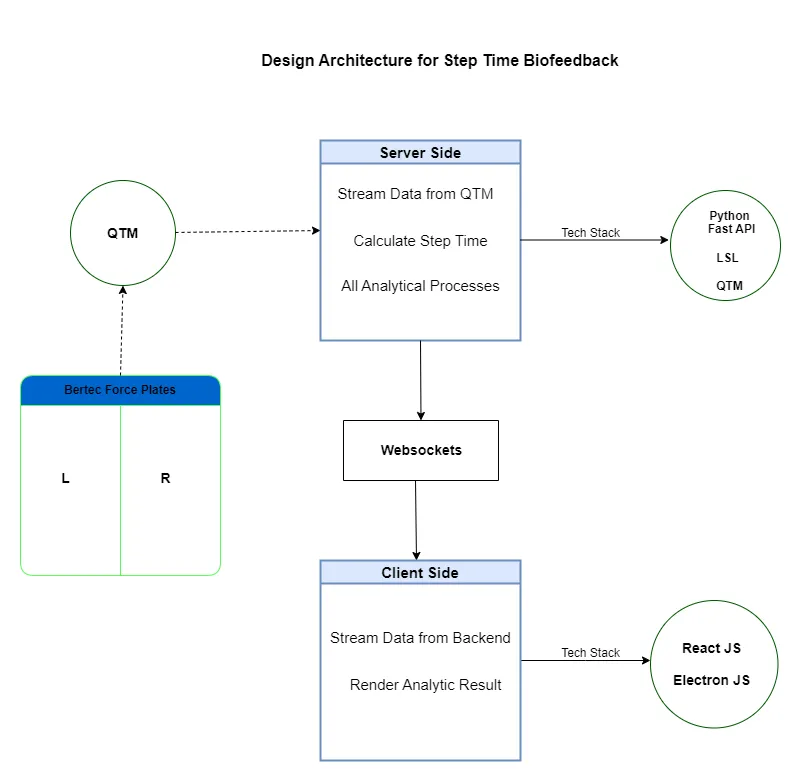

<!--  -->

## Overview

The StepTB is a project focused on developing a tool that leverages force signal data from a Bertec split-belt treadmill to calculate step time and project target zones into a biofeedback system. This system is intended to replicate a specific walking perturbation paradigm used in motor and gait learning protocols. The primary aim is to facilitate research comparing explicit (attentional) and implicit (procedural) methods of motor learning, which is crucial for developing optimal interventions for individuals with movement deficits and enhancing human performance.

### Information

- **Source Code:** [https://github.com/oss-slu/Step_Time_Biofeedback](https://github.com/oss-slu/Step_Time_Biofeedback) 
- **Client:** 
  - [Dr. Jason Longhurst, Ph.D., PT, DPT, NCS](https://www.slu.edu/doisy/faculty/longhurst-jason.php)
- **Current Tech Lead:** Victor Ojogbane Onoja 
- **Developers:**

  - Mark Mehta (capstone) 
  - Jack McPhillips (capstone) 
  - Noor Issa (capstone) 
  - Jacob Winter (capstone) 
   - Collin Seper (alumini) 

- **Start Date:** August 2024
- **Adoption Date:** August 2024
- **Technologies Used:**
  - Python
  - QTM
  - JavaScript (React JS, Electron JS)
  - Websockets
  - Lab Streaming Layer (Pylsl)
- **Type:** TBD
- **License:** [GNU General Public License v3.0](https://opensource.org/license/gpl-3-0/)

## Technical Information
The application leverages real-time data acquisition from a dual-belt Bertec Treadmill via the QTM software. This data is then streamed to the frontend interface using WebSocket technology. The frontend is developed using React JS for web-based access and bundled with Electron JS for desktop applications.

### Technical Overview

<!-- ### User Guide

Add guide when Type is determined. options include Desktop app, module, package, library

## Technical Information
The application gets real time data from dual belt Bertec Treadmil through QTM and streams data to the frontend using websockets

### Technical Overview

### Development Priorities

- Latest versions of npm, node, and react are essential
- Create a modern-looking user interface
- Incorporate automated testing
- Prioritize version control and collaboration
- Optimize performance -->

## Get Involved

If you would like to contribute to this project, please visit our [GitHub page](https://github.com/oss-slu/Step_Time_Biofeedback) to create your own issues or pull requests.
