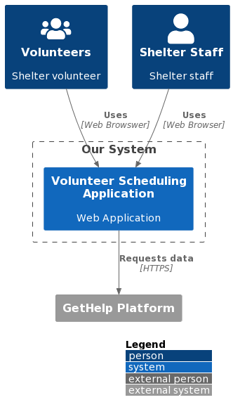

<!-- A header image is optional; if used should be no greater than 200x600 -->
<!-- -->

## Overview

Homeless shelters rely on volunteers' help. When inclement weather strikes, homeless shelters get filled with people that need a place to stay, and volunteers' help becomes even more important. There are many people willing to volunteer, but knowing which shelter lacks help is a challenge. The purpose of this application is to simplify the process of scheduling work shifts for volunteers, and to give homeless shelters visibility into their upcoming staffing. The application allows volunteers to select shelters and times when they want to work, see which shelters (and which times) urgently need help, and cancel/reschedule their shifts. The application will also allow shelter staff to see who is scheduled to help at their shelter on different dates and different times, and issue a 'call for help' when help is needed urgently.

### Information

- **Source Code:** <https://github.com/oss-slu/shelter_volunteers>
- **Client** Tim Huffman (House Everyone StL)
- **External Mentors** Women in Technology Group (WWT), GetHelp
- **Current Tech Lead:** Kate Holdener [GitHub](https://github.com/kate-holdener) [LinkedIn](https://www.linkedin.com/in/kate-holdener-ba032a3/)
- **Developers:**
  - [Abhilash Kotha](https://github.com/AbhilashKotha)
  - [Logan Wyas](https://github.com/loganwyas)
  - [Saiteja Gollapalli](https://github.com/Sai9797)
- **Start Date:** August, 2023
- **Adoption Date:** August, 2023
- **Technologies Used:** 
  - React
  - Flask
  - MongoDB
  - pytest, pylint
- **Type:** Web Application
- **License:** [MIT](https://opensource.org/license/mit)

## Users

The software will be deployed as a web application, and users will access the application through a web browswer. They will create an account, 
sign in and navigate the user interface to:
* Schedule work shifts
* See upcoming work shifts (possibly cancel some of them)
* See previous work shifts
* See the impact they have created (number of hours served, number of shelters helped, number of lives touched).

## Technical Information

The application is integraed with [GetHelp](https://gethelp.com/) API, for retrieving shelter information and user authentication. 
Integrating with GetHelp authentication API requires an API key. The development version of the application can be run in a 'bypass authentication' 
mode, that will bypass GetHelp authentication API and allow anyone to run the code in a development environment.
 

## Software Architecture Overview

We defie the context of our software system in the diagram below. Users (volunteers) and shelter staff will access the application through a web browser, and sign-in to their account with their own credentials. Our application relies on GetHelp system for shelter specific data and for authentication.

The details of the different containers within our system are shown in the picture below. The user interface of the application (the client side of our system) is written in React. The client side uses GetHelp API to locate nearby shelters. The client side of the application sends requests to sign in, save/retrieve user specific work shift data, and calculate the times when shelters need the most help to our server-side application. The server-side application communicates with the database to read/write user specific data.

## Development Priorities

- Complete volunteer scheduling functionality
- Improve UI/UX
- Deploy application for user testing
- User testing
- Develop shelter staff dashboard
- Deploy application for general use

## Get Involved

<!-- A group photo is optional; if used should be no greater than 800x800 -->
<!-- -->
Developers joining the project should follow the instructions in the 
[README](https://github.com/oss-slu/shelter_volunteers/blob/main/README.md) 
file of the project repository to run the application in a development environment.
